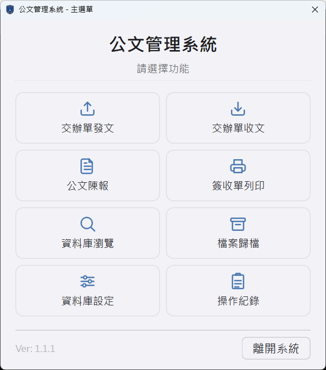
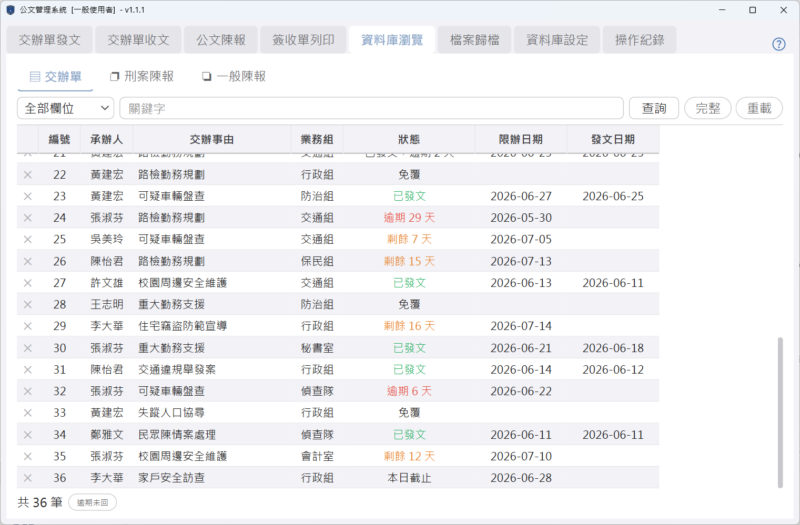
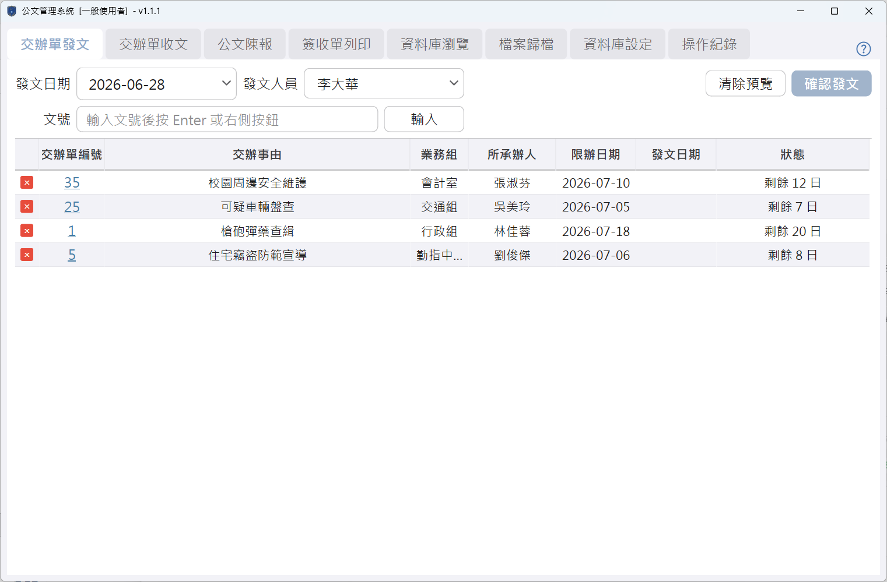
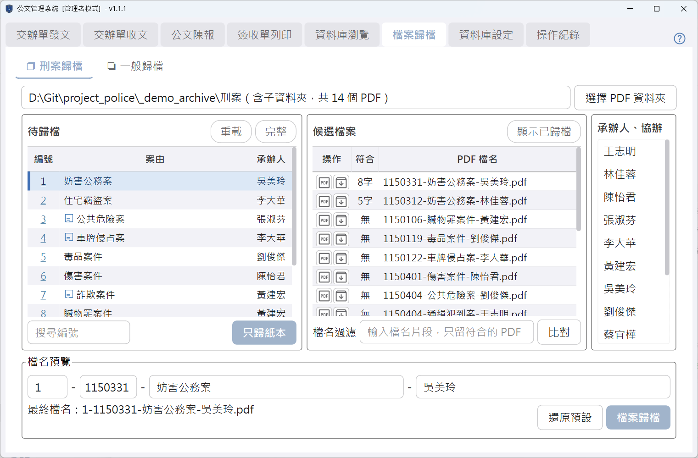
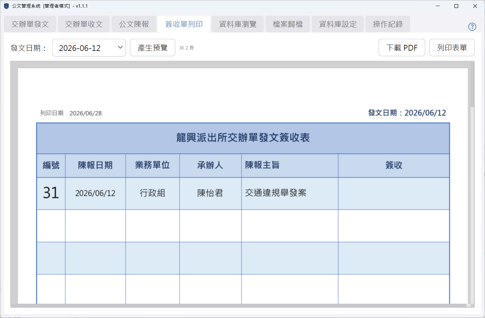
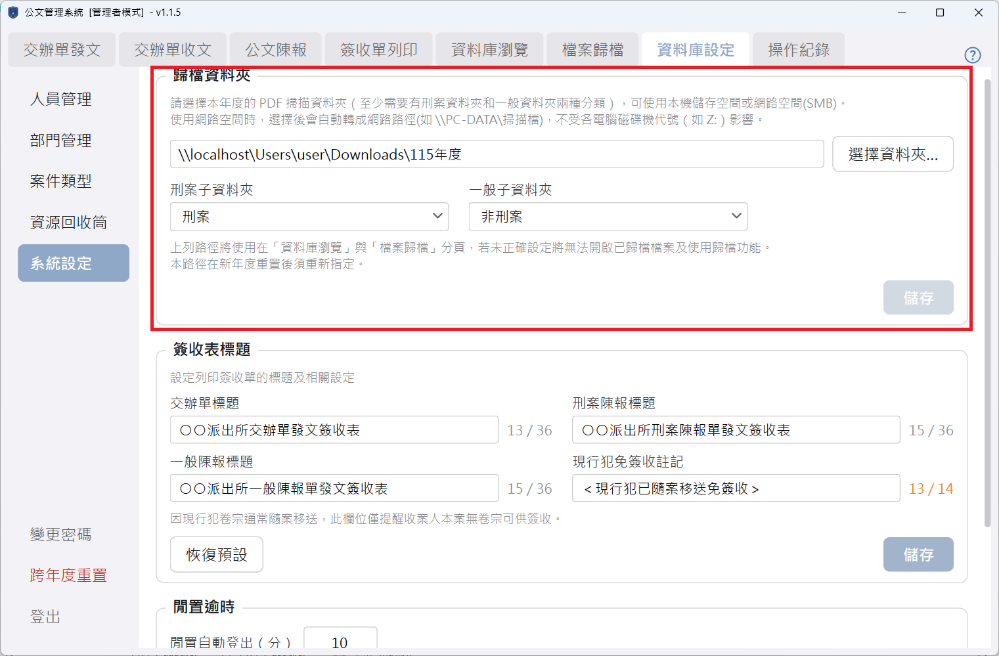
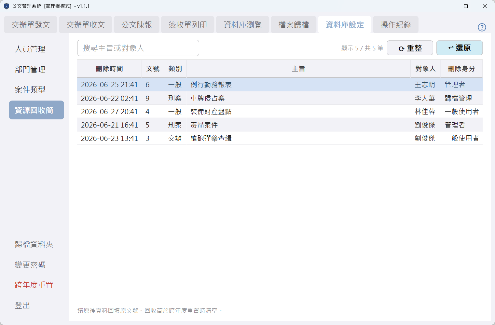

# 公文管理系統

> 警察單位公文的 **收文、交辦、陳報、歸檔、列印**，一站完成。

單機桌面程式，不需安裝、不需網路、不需資料庫伺服器——下載後雙擊就能用。專為承辦人員設計，把每天重複的公文流程（編文號、算逾期、改檔名、繕簽收表）交給程式處理。

<p align="center">
  
</p>

`Windows` ・ `免安裝單一執行檔` ・ 目前版本 **v1.1.5**

---

## 能幫你省下什麼

| 以前怎麼做 | 用這個系統 |
|-----------|-----------|
| 文號用 Excel 手動流水、容易跳號重號 | **文號自動編**，不重不漏 |
| 逐筆翻日期算還剩幾天、哪些逾期了 | **逾期一眼看顏色**（紅＝逾期、橘＝今日到期、綠＝已發文）|
| 掃描的 PDF 一個一個改檔名再歸檔 | **自動比對檔名**，挑對的公文按一下就歸好 |
| 送文本手寫，字醜又易漏 | **簽收單一鍵列印**或存 PDF |
| 在一堆檔案裡翻找某份公文 | **打關鍵字即時搜尋**，不分大小寫 |
| 寫錯、騰錯頁面整筆畫掉 | **資源回收筒可還原**，每天自動備份 |



> 💡 **逾期狀態怎麼判讀**：紅字＝已超過限辦日期還沒發文；橘字＝今天到期或發文時已逾期；綠字＝已準時發文；無顏色＝還在期限內或免回覆。

---

## 主要功能

程式開啟後是一排功能分頁，由左至右依序為：

| 功能 | 做什麼 |
|------|--------|
| **交辦單發文** | 把交辦單發出、登錄發文人員與文號，產生發文清單 |
| **交辦單收文** | 登錄收到的交辦單：收文日期、業務組、承辦人、限辦日期 |
| **公文陳報** | 向上陳報公文，分「刑案陳報」與「一般陳報」兩種表單 |
| **簽收單列印** | 依發文日期產生簽收表，預覽後列印或存成 PDF |
| **資料庫瀏覽** | 一覽全部公文、關鍵字搜尋、依逾期狀態篩選 |
| **檔案歸檔** | 把掃描好的 PDF 自動比對到對應公文，改成統一檔名歸檔 |
| **資料庫設定** | 維護人員／部門／案類、變更密碼、跨年度重置、資源回收筒；「系統設定」頁集中管理歸檔資料夾、簽收表標題、閒置時間 |
| **操作紀錄** | 查誰在何時做了什麼（刪除、還原、登入失敗等），可篩選與匯出 |

> 💡 **交辦單 vs. 陳報**：交辦單是上級交辦下來、需要分派承辦人的公文；陳報是本單位主動向上呈報的公文。
>
> 💡 **歸檔**：把公文的掃描電子檔（PDF）依固定規則命名、收進指定資料夾，方便日後查找。

**建檔長這樣**——上方填寫、下方即時預覽，確認無誤再送出：



**歸檔不用手動改檔名**——選一份待歸檔的公文，右側會自動把資料夾裡「最像」的 PDF 排在前面，並標出符合的字數；確認後按歸檔，檔案就會被改成標準檔名收好：



> 💡 **候選檔案的「符合 N 字」**：系統拿公文的日期、主旨、承辦人去比對 PDF 檔名，命中越多排越前面，幫你快速認出正確的檔案。

**簽收單一鍵產生**——選發文日期就排好整張表，可直接列印或存 PDF：



---

## 快速開始

### 1. 下載

到 [**最新版下載頁**](https://github.com/jerrygskk/project_police/releases/latest)，下載 **`PACKED.zip`**（裡面已含程式與空白資料庫兩個檔案）。

> 也可以分開下載：`Police-Document-Manager.exe`（主程式）＋ `dbfile.db`（空白資料庫）。

### 2. 擺放

把 **`Police-Document-Manager.exe`** 和 **`dbfile.db`** 放在**同一個資料夾**（例如桌面新增一個「公文系統」資料夾）。

> ⚠️ 兩個檔案必須在一起。`dbfile.db` 是你所有公文資料的所在，請當成重要檔案保管、定期另存備份。

### 3. 開啟與初次設定

雙擊 **`Police-Document-Manager.exe`** 即可使用。日常的收發文、建檔、列印**不需登入**；但初次設定（以及日後的刪除管理、設定維護、操作紀錄）需要以管理身分登入：

- 進「**資料庫設定**」輸入密碼登入。預設密碼——管理者：`admin`、歸檔管理：`0000`。
- 登入後進「**人員管理／部門管理**」，把單位的人員與部門建好。
- 進「**系統設定**」，設定「**歸檔資料夾**」與「**簽收表標題**」兩項（步驟見下方）。

> ⚠️ **首次登入後請立即至「變更密碼」修改**，預設密碼僅供初次設定使用。變更成功後系統會自動登出，請以新密碼重新登入。

> 💡 **想先看操作圖解**？下載頁附有 **`Quick_Start.pdf` 速查卡**（兩頁 A4），涵蓋每個功能的重點步驟。

### 設定歸檔資料夾

「檔案歸檔」與「資料庫瀏覽開啟 PDF」都依賴這項設定。到「**資料庫設定 → 系統設定 → 歸檔資料夾**」設定，重點是 **一個「本年度資料夾」底下放兩個分類子資料夾**：

<p align="center">
  
</p>

1. **本年度資料夾**：按「選擇資料夾…」，挑選本年度掃描 PDF 的存放位置。
2. **刑案子資料夾 / 一般子資料夾**：選好上層資料夾後，下方會自動列出它底下的子資料夾，分別指定哪個放刑案、哪個放一般（也可手動輸入名稱）。
3. 按「儲存」。

建議的資料夾結構（名稱可自訂）：

```
案件掃描檔\115年\        ← 步驟 1 選這層（本年度資料夾）
├─ 刑案\                 ← 指定為「刑案子資料夾」
└─ 一般\                 ← 指定為「一般子資料夾」
```

> 💡 **為什麼路徑會自動變成 `\\電腦名稱\…` 這種樣子**：若資料夾在共用網路磁碟（例如 `Z:`），程式會自動把磁碟機代號改寫成「網路路徑（UNC）」再儲存。因為每台電腦對映的代號可能不同（這台是 `Z:`、那台是 `Y:`），改存網路路徑後，每台電腦都能找到同一個資料夾。
>
> 💡 **網路路徑（UNC）**：以 `\\` 開頭、用電腦／伺服器名稱定位資料夾的寫法，例如 `\\PC-SERVER\案件掃描檔\115年`，不依賴磁碟機代號。

> ⚠️ 若路徑框出現**橘色外框**，代表選到的資料夾無法轉成網路路徑（例如選到本機 `C:` 槽）。自己一台電腦用沒關係；要給多人共用，請改放在共用網路磁碟上的資料夾。
>
> ⚠️ **沒設定會怎樣**：「檔案歸檔」無法比對、「資料庫瀏覽」開不了 PDF。另外，**跨年度重置後這項設定會被清空**，新年度要重新指定。

### 設定簽收表標題

簽收表標題裡的單位名稱，一開始先用「○○」代替（例如印成「○○分局交辦單簽收表」），用之前請改成自己的單位名稱。到「**資料庫設定 → 系統設定 → 簽收表標題**」（需管理者登入）就能改：

1. 四個欄位整句可編輯——**交辦單、刑案陳報、一般陳報**三張表的標題，以及**現行犯免簽收註記**。
2. 把標題裡的 `○○` 改成自己的單位名稱（其餘文字也可整句自訂），按「儲存」。可按「恢復預設」帶入預設標題。

> 💡 **現行犯免簽收註記**：現行犯卷宗通常隨案移送，簽收表上這句備註用來提醒收案人本案無卷宗可供簽收。文字可整句自訂。

> ⚠️ 此設定屬單位永久設定，**跨年度重置不會清空**。

---

## 常見問題

**Q：不小心把公文刪掉了怎麼辦？**
刪除的公文會進「資源回收筒」（資料庫設定頁，需管理者登入），選取後按「還原」即可救回原本的文號與內容。



**Q：資料會不會不見？**
程式每天開啟時會自動備份（保留最近數份），存在資料庫旁的 `backups` 資料夾。但這只防本機檔案毀損，**仍建議定期把整個資料夾另存到隨身碟或網路硬碟**，以防電腦整台故障。

**Q：可以多台電腦同時開同一份資料嗎？**
可以把資料庫放在共用網路磁碟給多人輪流使用。若有人已開啟，他人開啟時會跳出提醒。但**不建議多人同時編輯**，可能造成資料毀損——請輪流使用。

**Q：需要安裝、或連外部網路嗎？**
都不需要。程式免安裝、雙擊即用，也不需要連網際網路、不需要架設資料庫伺服器。所有資料就存在 `dbfile.db` 這一個檔案裡——可放在本機自己用，也可以放在單位內部的共用網路磁碟給多人輪流使用（見上一題）。

**Q：搜尋區分大小寫嗎？**
不分大小寫，輸入片段即時比對。

**Q：閒置會怎樣？**
管理身分閒置一段時間會自動登出（降回一般使用者，預設 10 分鐘）；任何身分閒置過久程式會自動關閉（預設 14 分半），請留意未送出的輸入。兩個時間都可在「**資料庫設定 → 系統設定 → 閒置逾時**」調整，設 0 表示不作用。

> 💡 **名詞速查**
> - **軟刪除**：刪除公文時只清空內容、保留文號，所以文號不會被重複使用（刪掉的那筆會標示「此文號無法再使用」）。
> - **跨年度重置**：新年度開始時，把所有公文清空、文號歸零重新計算的功能（屬管理者操作，執行前會自動備份）。
> - **承辦人 / 協辦**：負責處理該公文的人員；歸檔比對時會用來辨識檔案。

---

## 下載與版本

- **下載**：[GitHub Releases](https://github.com/jerrygskk/project_police/releases/latest)
- **目前版本**：v1.1.5

每個版本的下載頁提供四個檔案：

| 檔案 | 用途 |
|------|------|
| `PACKED.zip` | 程式＋空白資料庫打包，**新使用者下載這個** |
| `Police-Document-Manager.exe` | 主程式（單一執行檔） |
| `dbfile.db` | 空白資料庫（全新安裝用） |
| `Quick_Start.pdf` | 兩頁速查卡 |

> ⚠️ **升級時不要覆蓋你的 `dbfile.db`**——那是你的資料。升級只需把新的 `.exe` 換掉舊的即可。

---

## 給維護者 / 開發者

技術文件（架構、開發慣例、踩雷紀錄、打包與資料庫結構）見 **[DEVELOPER.md](DEVELOPER.md)**。
